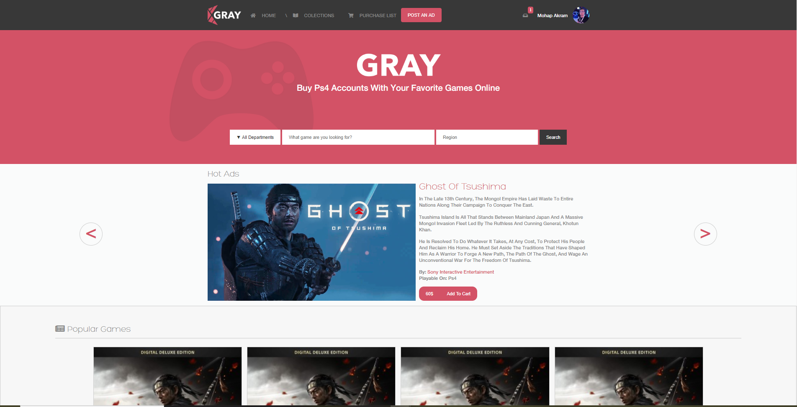

# Gray Games Shop

> This is my capstone project which is an online shop .

Additional description about the project and its features.

## Built With

- HTML
- CSS (LESS)

## Live Demo

[Live Demo Link](https://rawcdn.githack.com/mohapakram/games-store/b95c12628d0ca1b7d8eb85022da6839d48f5d229/index.html)

## Getting Started

Just clone the project and open `index.html` file in chrome.

## Authors

👤 **Author1**

- Github: [@mohabakram](https://github.com/mohabakram)
- Twitter: [@mohapakram](https://twitter.com/mohapakram)
- Linkedin: [mohapakram](https://www.linkedin.com/in/mohab-akram-667093131)

## 🤝 Contributing

Contributions, issues and feature requests are welcome!

Feel free to check the [issues page](issues/).

## Show your support

Give a ⭐️ if you like this project!

## Acknowledgments

- Hat tip to anyone whose code was used
- Inspiration
- etc

## 📝 License

This project is [MIT](lic.url) licensed.
